# Project 1 – Instruction Prompts

### Prompt Type & Goal

Testing **specificity levels** in direct instruction prompts—comparing how vague, basic, and detailed instructions affect the quality, accuracy, and creativity of AI-generated outputs.

---

## Experiment Setup

### Models and Versions
-   Claude Sonnet 4.5
-   ChatGPT (GPT-4 or GPT-4o)
-   Google Gemini (2.5 Flash)
-   Perplexity AI

### Dataset or Tasks
**Task:** Write a product description for a fictional **"FitPulse Pro" smartwatch**

**Product details:**
-   Heart rate monitoring with real-time tracking
-   Built-in GPS for route mapping
-   7-day battery life
-   Water-resistant design
-   Target audience: Health-conscious professionals aged 25-40

### Hypothesis
More specific instructions will produce higher scores in Structure and Accuracy across all models, but may reduce Creativity scores due to constraints. Different AI models may respond differently to the same level of specificity.

### Control Variables
-   Same product features and audience across all tests
-   Same prompt wording for each version across all models
-   Same evaluation criteria and scoring rubric

---

## Prompt Versions

### V1 (Minimal Instruction)
Write a product description for FitPulsePro Smartwatch

### V2 (Basic Instruction)
Write a product description for FitPulsePro smartwatch. Include key features like battery life and heart rate monitoring.

### V3 (Detailed Instruction)
Write a product description for FitPulsePro smartwatch using **ONLY** the details provided below. Do not add any features not listed. Make it relatable and understandable for professionals aged 25-40.

**Required features to include:**
-   Heart rate monitoring with real-time tracking
-   Built-in GPS for route mapping
-   7-day battery life
-   Water-resistant design

**Constraints:**
-   **Target Audience:** Health-conscious professionals aged 25-40
-   **Tone:** Professional yet approachable
-   **Word count:** 100-150 words

---

## Output Versions

### V1 Outputs (Minimal Instruction)

| Model | Output |
| :--- | :--- |
| **Claude** | 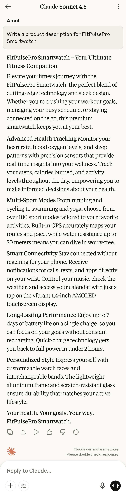 |
| **ChatGPT** | 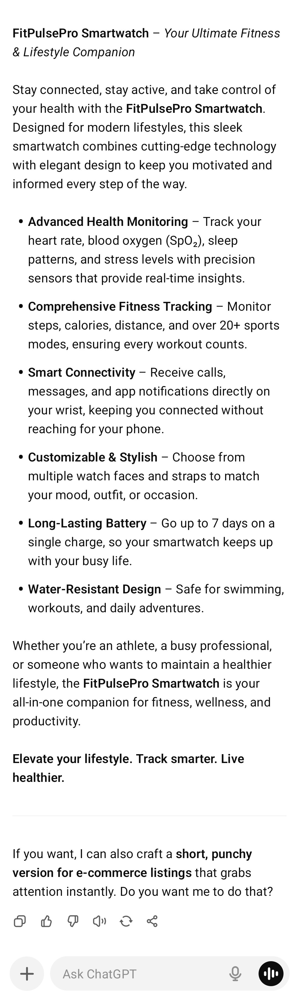 |
| **Gemini** | 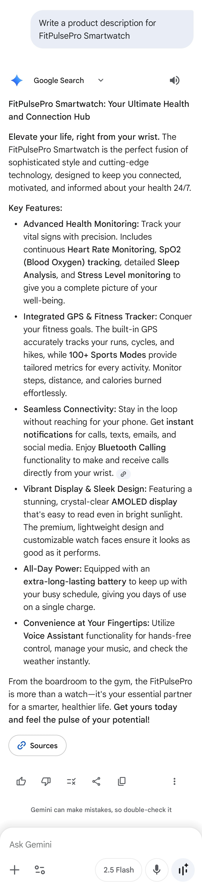 |
| **Perplexity** |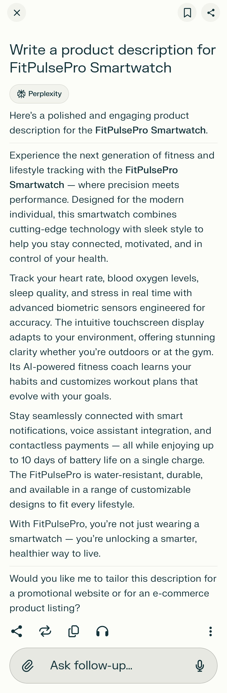 |

| V1 Evaluation | Clarity | Accuracy | Tone | Creativity | Structure | Avg | Compliance |
| :--- | :--- | :--- | :--- | :--- | :--- | :--- | :--- |
| **Claude** | 3 | 2 | 4 | 3 | 4 | 3.2 | No extra features? N • Audience fit? Y |
| **ChatGPT** | 4 | 2 | 4 | 3 | 4 | 3.4 | No extra features? N • Audience fit? Y |
| **Gemini** | 3 | 2 | 4 | 3 | 4 | 3.2 | No extra features? N • Audience fit? Y |
| **Perplexity** | 4 | 2 | 5 | 4 | 5 | 4.0 | No extra features? N • Audience fit? Y |

---

### V2 Outputs (Basic Instruction)

| Model | Output |
| :--- | :--- |
| **Claude** | 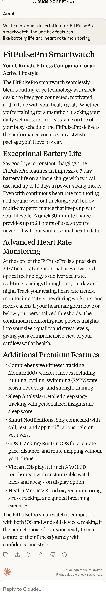 |
| **ChatGPT** | 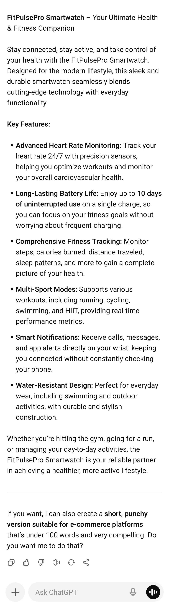 |
| **Gemini** | 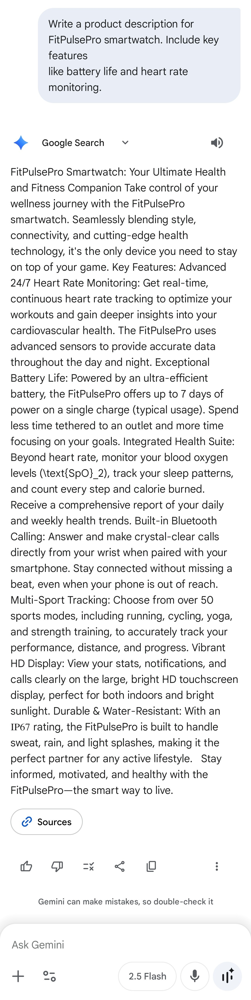 |
| **Perplexity** | 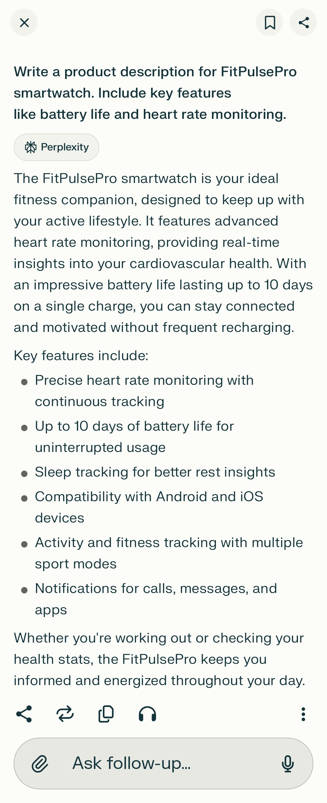 |

| V2 Evaluation | Clarity | Accuracy | Tone | Creativity | Structure | Avg | Compliance |
| :--- | :--- | :--- | :--- | :--- | :--- | :--- | :--- |
| **Claude** | 3 | 2 | 4 | 3 | 4 | 3.2 | No extra features? N • Audience fit? Y |
| **ChatGPT** | 5 | 3 | 4 | 3 | 5 | 4.0 | No extra features? N • Audience fit? Y |
| **Gemini** | 3 | 2 | 3 | 2 | 3 | 2.6 | No extra features? N • Audience fit? Y |
| **Perplexity** | 5 | 2 | 4 | 3 | 5 | 3.8 | No extra features? N • Audience fit? Y |

---

### V3 Outputs (Detailed Instruction)

| Model | Output |
| :--- | :--- |
| **Claude** | 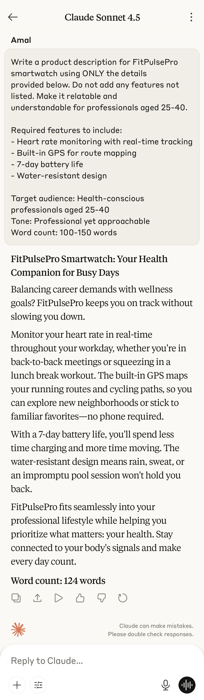 |
| **ChatGPT** | 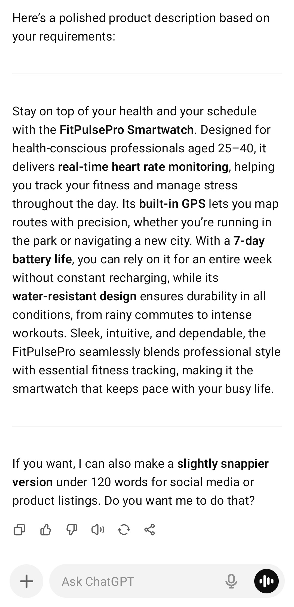 |
| **Gemini** | 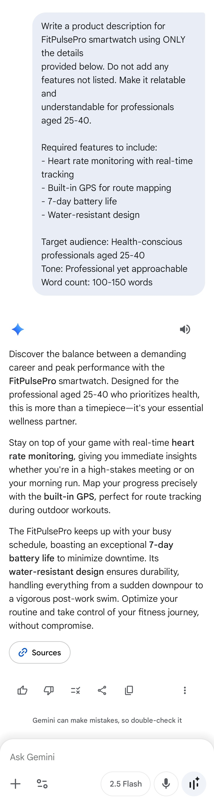  |
| **Perplexity** | 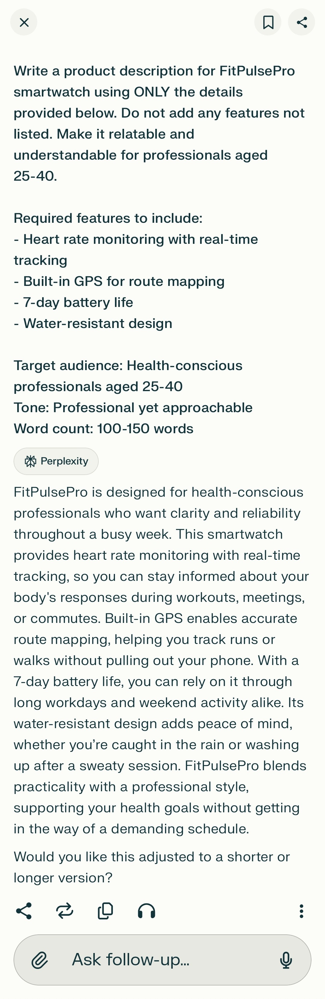  |

| V3 Evaluation | Clarity | Accuracy | Tone | Creativity | Structure | Avg | Compliance |
| :--- | :--- | :--- | :--- | :--- | :--- | :--- | :--- |
| **Claude** | 5 | 5 | 5 | 4 | 5 | 4.8 | No extra features? Y • 100–150 words? Y • Audience fit? Y |
| **ChatGPT** | 5 | 5 | 5 | 4 | 5 | 4.8 | No extra features? Y • 100–150 words? Y • Audience fit? Y |
| **Gemini** | 5 | 5 | 5 | 4 | 5 | 4.8 | No extra features? Y • 100–150 words? Y • Audience fit? Y |
| **Perplexity** | 5 | 5 | 5 | 4 | 5 | 4.8 | No extra features? Y • 100–150 words? Y • Audience fit? Y |

---

## Scoring Rubric (1–5)

| Metric | Score 5 | Score 3 | Score 1 |
| :--- | :--- | :--- | :--- |
| **Clarity** | Crystal clear and unambiguous. | Understandable with minor ambiguity. | Confusing or incomplete. |
| **Accuracy** | Fully correct and on-goal. | Partially correct with small errors. | Incorrect or off-target. |
| **Tone** | Perfectly matched to context and audience. | Acceptable but uneven. | Inappropriate or mismatched. |
| **Creativity** | Original and compelling. | Some novelty. | Generic or stale. |
| **Structure** | Well organized with logical flow and helpful formatting. | Some structure but minor issues. | Disorganized or hard to scan. |

---

## Results & Insights

### 📊 Performance by Prompt Version

| Prompt Type | Clarity | Accuracy | Tone | Creativity | Structure | Overall |
| :--- | :--- | :--- | :--- | :--- | :--- | :--- |
| **V1 (Minimal)** | 3.5 | 2.0 | 4.25 | 3.25 | 4.25 | **3.4/5** |
| **V2 (Basic)** | 4.0 | 2.25 | 3.75 | 2.75 | 4.25 | **3.4/5** |
| **V3 (Detailed)** | 5.0 | 5.0 | 5.0 | 4.0 | 5.0 | **4.8/5** |

> **V1 → V3 Improvement: +41%**

### 🔍 Key Findings

1.  **Accuracy Is Everything**
    * **V1 & V2:** ALL models **hallucinated** features (2.0-2.25/5).
    * **V3:** PERFECT accuracy across all models (5.0/5).
    * The phrase **"Do not add any features not listed"** eliminated 100% of hallucinations.
2.  **The V2 Problem**
    * V2 actually performed **worse** than V1 in creativity (2.75 vs 3.25) and tone (3.75 vs 4.25). Partial specificity **confused models** more than complete freedom.
3.  **V3 Achieved Near-Perfect Results**
    * Achieved **5.0/5** in Clarity, Accuracy, and Tone across the board.
    * All models complied with word count and zero extra features were added.

---

## ✅ What Worked

**V3's Winning Formula:**
1.  **Explicit negative instruction:** "don't add extra details"
2.  **Specific feature list** (4 items, bulleted)
3.  **Clear audience:** "professionals aged 25-40"
4.  **Word count constraint:** "100-150 words"
5.  **Context + constraints** used together.

**Result:** Every model followed instructions perfectly, leading to a massive increase in quality.

---

## ❌ What Didn't Work

**V1 Problems:**
-   Vague prompts = 100% feature hallucination.
-   Every model added 5-10+ unauthorized features.
-   Accuracy scored only 2.0/5.

**V2 Problems (The "Half-Specific" Trap):**
-   Adding some info without full constraints led to the worst scores in Creativity and Tone.
-   **Lesson:** Go fully specific (V3) or stay fully open (V1). The middle ground often fails.

---

## 💡 Unexpected Findings

1.  **V3 wasn't less creative**—it scored 4.0 vs V2's 2.75. Clear boundaries enabled **strategic creativity** and storytelling vs. generic feature lists.
2.  **Audience definition is magic**—Simply adding "aged 25-40 professionals" jumped Tone from 3.75 → 5.0, a small change with a massive impact.

---

## 🚀 Next Iteration Ideas

1.  **Test V4:** Remove "don't add extras" from V3 to isolate its impact.
2.  **Vary word counts:** 50-75 words vs 150-200 words vs unlimited.
3.  **Test instruction order:** Constraints-first vs context-first.
4.  **A/B test audience specificity:** How detailed must the audience be?
5.  **Try different constraint types:** Format, style, and length variations.

---

## 🎓 Key Takeaways

-   **Detailed prompts outperform vague prompts by 41%.**
-   **Explicit boundaries eliminate hallucination** (2.0 → 5.0 accuracy).
-   **Partial specificity hurts more than it helps.**
-   **Creativity thrives within clear boundaries**, not despite them.

---
### **Conclusion:** 
Prompt specificity directly determines output quality. Detailed instructions with explicit constraints (V3) produced near-perfect results across all AI models tested.