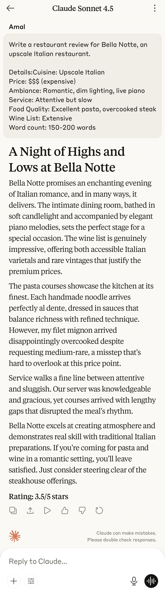

# Project 2 – Role-based Prompts

## 🎯 Prompt Type & Goal

Testing how assigning **distinct personalities/personas** affects output tone, vocabulary, focus areas, and writing style when reviewing the same restaurant.

---

## 🧪 Experiment Setup

### Models and Versions
-   Claude Sonnet 4.5

### Dataset or Tasks
**Task:** Write a restaurant review for "Bella Notte" - an upscale Italian restaurant

**Restaurant Details (provided to all prompts):**

- Cuisine: Upscale Italian
- Price: $$$ (expensive)
- Ambiance: Romantic, dim lighting, live piano
- Service: Attentive but slow
- Food Quality: Excellent pasta, overcooked steak
- Wine List: Extensive

### Hypothesis
Role assignment will dramatically shift tone, focus, and vocabulary. Critics will focus on technical details, budget-conscious reviewers on value, and personality-driven roles will use distinctive language patterns.

### Control Variables
- Same restaurant details
- Same models and settings
- Same word count target (150-200)
- Same task (write review)

## 📂 Prompt Versions

### V1: No Role (Baseline)
Write a restaurant review for Bella Notte, an upscale Italian restaurant.

- Details: Cuisine: Upscale Italian  
- Price: $$$ (expensive)  
- Ambiance: Romantic, dim lighting, live piano  
- Service: Attentive but slow  
- Food Quality: Excellent pasta, overcooked steak  
- Wine List: Extensive  
- Word count: 150-200 words  

---

### V2: Gordon Ramsay (Brutal Critic)
You are Gordon Ramsay, the world-famous chef known for brutal honesty and high standards. Write a restaurant review for Bella Notte.

- Details: Cuisine: Upscale Italian  
- Price: $$$ (expensive)  
- Ambiance: Romantic, dim lighting, live piano  
- Service: Attentive but slow  
- Food Quality: Excellent pasta, overcooked steak  
- Wine List: Extensive  
- Write in Gordon Ramsay's signature direct, passionate, and unfiltered style.  
- Word count: 150-200 words  

---

### V3: Enthusiastic Food Blogger
You are a food blogger who absolutely LOVES everything and finds positives in every dining experience. You use lots of exclamation marks and enthusiastic language. Write a restaurant review for Bella Notte.

- Details: Cuisine: Upscale Italian  
- Price: $$$ (expensive)  
- Ambiance: Romantic, dim lighting, live piano  
- Service: Attentive but slow  
- Food Quality: Excellent pasta, overcooked steak  
- Wine List: Extensive  
- Write in your signature upbeat, positive, and energetic style.  
- Word count: 150-200 words  

---

### V4: Michelin Inspector (Refined Analyst)
You are a Michelin Guide inspector known for refined taste, attention to detail, and sophisticated analysis. Write a restaurant review for Bella Notte.

- Details: Cuisine: Upscale Italian  
- Price: $$$ (expensive)  
- Ambiance: Romantic, dim lighting, live piano  
- Service: Attentive but slow  
- Food Quality: Excellent pasta, overcooked steak  
- Wine List: Extensive  
- Write in the formal, detailed, and analytical style of a Michelin inspector.  
- Word count: 150-200 words  

---

### V5: Budget-Conscious College Student
You are a college student on a tight budget who rarely eats at expensive restaurants. Write a restaurant review for Bella Notte from your perspective.

- Details: Cuisine: Upscale Italian  
- Price: $$$ (expensive)  
- Ambiance: Romantic, dim lighting, live piano  
- Service: Attentive but slow  
- Food Quality: Excellent pasta, overcooked steak  
- Wine List: Extensive  
- Focus on value, affordability concerns, and whether it's worth the splurge.  
- Word count: 150-200 words  

---
## Output Versions

| Version | Output |
| :--- | :--- |
| **V1** |  |
| **V2** |  |
| **V3** |  |
| **V4** | |
| **V5** | |

## 🧪 Evaluation

| Version | Clarity | Accuracy | Tone | Creativity | Structure | Role Adherence | Average |
|:--------|:--------|:---------|:-----|:-----------|:----------|:----------------|:--------|
| **V1**  | 4       | 2.0      | 4    | 3          | 4         | 3              | 3.30    |
| **V2**  | 4       | 2.0      | 5    | 4          | 4         | 5              | 4.00    |
| **V3**  | 5       | 2.0      | 5    | 4          | 5         | 5              | 4.33    |
| **V4**  | 5       | 3.0      | 5    | 4          | 5         | 5              | 4.50    |
| **V5**  | 5       | 3.5      | 5    | 4          | 5         | 5              | 4.58    |

---

## Scoring Rubric (1–5)

| Metric | Score 5 | Score 3 | Score 1 |
| :--- | :--- | :--- | :--- |
| **Clarity** | Crystal clear and unambiguous. | Understandable with minor ambiguity. | Confusing or incomplete. |
| **Accuracy** | Fully correct and on-goal. | Partially correct with small errors. | Incorrect or off-target. |
| **Tone** | Perfectly role match. | Acceptable but somewhat generic. | generic or no personality. |
| **Creativity** | Unique voice,memorable. | Some novelty. | Generic or formulaic. |
| **Structure** | Well organized with logical flow and helpful formatting. | Some structure but minor issues. | Disorganized or hard to scan. |
| **Role Adherence** | Perfect role embodiment - instantly recognizable as the assigned persona. | Role characteristics present but inconsistent - some personality shows through but generic at times | No role identity - could be written by anyone, no distinctive voice |

---

## 📊 Results & Insights

### 🔢 Final Scores Summary

| Version | Role                          | Final Score |
|---------|-------------------------------|-------------|
| V1      | No Role (Baseline)            | 3.30        |
| V2      | Gordon Ramsay (Brutal Critic) | 4.00        |
| V3      | Enthusiastic Food Blogger     | 4.33        |
| V4      | Michelin Inspector            | 4.50        |
| V5      | College Student (Budget)      | 4.58        |

---

### 📈 Performance Trends

- **V1 (Baseline)**: Lowest overall score due to lack of constraints and multiple hallucinations. Tone was neutral but generic.
- **V2 (Gordon Ramsay)**: Strong tone and persona adherence, but accuracy suffered from theatrical exaggerations.
- **V3 (Food Blogger)**: High tone and structure scores, but vivid embellishments hurt accuracy.
- **V4 (Michelin Inspector)**: Most refined and structured output. Minor hallucinations, but excellent role execution.
- **V5 (College Student)**: Highest overall score. Balanced tone, relatable voice, and strong clarity with minimal factual drift.

---

### 🧠 Key Findings

#### 1. 🎭 Role Adherence Drives Quality
- V4 and V5 scored perfect 5s in Role Adherence, Tone, and Structure.
- Persona clarity helps models stay consistent in vocabulary, pacing, and emotional framing.

#### 2. 🎯 Accuracy Still the Bottleneck
- All versions except V5 and V4 suffered from hallucinated details.
- Even strong personas (V2, V3) introduced invented elements to enhance storytelling.

#### 3. 🧱 Structure Matters
- V4 and V5 followed a clear progression: ambiance → food → service → verdict.
- V1 and V3 were slightly less disciplined, affecting clarity and flow.

#### 4. 💡 Creativity Thrives in Constraint
- V3 and V5 showed that emotional or financial framing unlocks expressive language.
- V2’s sarcasm and V3’s enthusiasm added memorable flair despite factual drift.

---

### 📉 Visual Summary

#### 📊 Line Chart: Total score by versions

This line plot visualizes the **Accuracy Score progression** across all prompt versions (V1–V5), highlighting how persona-driven constraints (starting with V2 and V3) significantly reduce hallucinations and improve factual precision.

#### 🕸️ Radar Chart: Total score by versions

This radar chart compares four evaluation dimensions—**Accuracy, Tone, Creativity and Role Adherence**—across all five prompt versions. It reveals how structured personas (V4 and V5) consistently outperform the baseline (V1), especially in Tone and Role Adherence.

---

### ✅ Takeaways

- **V5 wins** for relatability, clarity, and value-focused critique.
- **V4 excels** in professionalism and culinary analysis.
- **V3 and V2** shine in tone but need tighter factual control.
- **V1 proves** that lack of role and constraints leads to drift and generic output.

---

### 🚀 Next Steps

- Test V6 with “no hallucination allowed” constraint.
- Try hybrid personas (e.g., “Budget-conscious foodie”).
- Introduce audience targeting to refine tone even further.

### 📕 Conclusion

This experiment confirms that **role-driven prompting combined with clear constraints** produces significantly higher-quality outputs. The best-performing reviews (V4 and V5) balanced tone, structure, and persona while minimizing hallucinations. Generic prompts (V1) led to drift and weaker engagement, while partially constrained prompts (V2) introduced confusion. The heatmap reveals that **accuracy remains the most volatile metric**, while tone and role adherence are consistently strong when personas are well-defined.

> 🎓 Prompt engineering isn’t just about giving instructions — it’s about designing identity, context, and boundaries that guide the model toward excellence.

---
## 🛑 Project Disclaimers

### 🧪 Grading Methodology
All evaluation scores (Clarity, Accuracy, Tone, Creativity, Structure, Role Adherence) reflect human judgment based on clearly defined criteria outlined in the [Evaluation Criteria page](evaluation-criteria.md). These scores are manually assigned and are not generated by AI models or automated systems.

### ⚠️ Coincidence Clause
All content in this project is fictional and created solely for educational and experimental purposes. Any resemblance to real-world restaurants, individuals, companies, or experiences is purely coincidental and unintended.

### 🤖 AI Output Notice
All reviews and analyses were generated using AI tools based on controlled prompt inputs. The outputs do not represent personal opinions or endorsements, and should not be interpreted as factual restaurant reviews or professional recommendations.